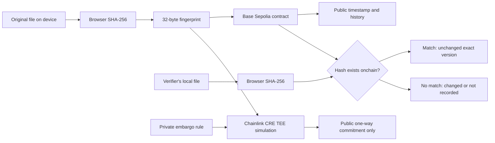

# DeSci Proof Notebook Project Report / 專案研究報告

## 摘要

研究照片、影片、PDF 與 CSV 可以被修改，電腦顯示的檔案日期也不是可信的第三方證據。
DeSci Proof Notebook 讓使用者在瀏覽器本機計算 SHA-256 指紋，不上傳原始檔，
再把指紋、標題、公開短文、錢包地址與區塊鏈時間寫入 Base Sepolia。任何人日後
都能用原始檔免費查驗是否完全相同。專案另以 Chainlink CRE Confidential Workflow
示範如何在 TEE 中處理私人研究禁運規則，只公開不可逆的 commitment。

## 研究問題

能否製作一個不需要上傳研究原始檔、一般人也看得懂，而且能讓第三方獨立查驗
「某個檔案版本在某個時間已經存在」的工具？

## 設計假設

1. 相同檔案會得到相同 SHA-256，不同內容幾乎一定得到不同指紋。
2. 把小型指紋寫上公開測試鏈，比把大型或敏感原始檔上傳更節省且更保護隱私。
3. 驗證只需讀取公開資料，因此可以不連錢包、不簽名、不持有 ETH。
4. 時間戳記是輔助證據，不應被誇大成作者、專利、地點或科學真實性的自動證明。

## 系統架構



## 使用技術與用途

| 技術 | 在專案中的用途 |
| --- | --- |
| React 18 + TypeScript | 建立中英雙語單頁操作介面與狀態管理 |
| Vite | 開發、最佳化建置與 GitHub Pages 靜態發布 |
| Web Crypto API | 在瀏覽器本機執行 SHA-256，不上傳檔案 |
| ethers v6 | 連接 MetaMask、切換 Base Sepolia、讀寫合約 |
| Solidity | 儲存檔案指紋、建立者、時間、標題與公開短文 |
| Base Sepolia | 免費測試網上的公開、可查驗時間紀錄 |
| Chainlink CRE SDK | 建立 `handlerInTee` 機密流程與本機模擬 |
| Bun + pnpm | 編譯 CRE TypeScript 與鎖定依賴版本 |
| GitHub Actions + Pages | 自動建置與公開託管網站 |
| Lucide React | 使用一致、可辨識的介面圖示 |

執行中的網站沒有呼叫任何 AI API，也沒有後端、資料庫、IPFS 或檔案上傳服務。
AI 工具有協助產生程式與文件；實際產品不會把使用者資料送給 AI。

## 智能合約資料與函數

每筆 `Proof` 包含 `creator`、`timestamp`、`title` 與 `note`，並以 `bytes32 fileHash`
作為索引。`anchorProof` 建立不可逆存證，`getProof` 依指紋查詢，
`getProofHashesByCreator` 取得某地址的公開歷史。事件 `ProofAnchored` 讓鏈上工具
可以索引新紀錄。同一個指紋只接受第一筆存證，避免重複覆寫最早時間。

## 實驗方法與結果

控制檔案為 `demo/battery-cycle-original.csv`；實驗檔只把一個容量值由 1971 改成
1999。兩者的 SHA-256 結果如下：

```text
original: 98c90262d08bef2b6ad69261dc84f7931d41ade9501645fc7859f3f3d2dec602
tampered: b0552b28f5f9a462134aba94b930d962094eafb94f3d7f077f94237f736eab31
```

結果不同，證明即使小改動也能被檔案指紋查驗流程發現。Base Sepolia 合約地址
`0xD505ad9d439ee159eE4Af3ad331F417C3B8A4a29` 經 RPC 檢查含有 3914 bytes 的
合約程式碼。網站 production build 與 Solidity compile 均已通過。

Chainlink CRE 模擬使用原始 CSV 的同一個指紋與一個合成私人禁運規則，成功輸出：

```text
commitment: 0x9180230a5e5f68097684d9b351ebc52e12de09f8962d453e38f109c85d5f25b1
```

模擬器不是實際 TEE，因此這是可重現的開發證據，不代表線上 CRE 已部署。

## 可解決的問題

1. 學生在分享發明筆記前，留下該版本已存在的時間輔助證據。
2. 野外研究者在後製前，替原始照片或影片版本留下可查驗指紋。
3. 小型實驗室每日存證儀器 CSV，日後找出未揭露的檔案修改。
4. DeSci 社群查看公開研究歷程，再搭配重現、同行評審與其他證據評估研究。
5. 私人禁運或揭露條件可先形成 commitment，而不直接公開規則內容。

## 優點

- 原始檔完全留在裝置內，降低資料外洩與儲存成本。
- 驗證與公開紀錄查詢不需要錢包或餘額。
- 鏈上紀錄可脫離本網站獨立查驗。
- 中英雙語與簡單文字降低 Web3 使用門檻。
- 合約、版本歷史、AI 使用與 Chainlink 模擬證據全部公開。
- 測試網版本不需投入真實資產。

## 限制

- 建立存證仍要 MetaMask、Base Sepolia 測試 ETH 與每筆交易簽名。
- 網站無法判斷檔案內容是否造假，只能判斷被查驗版本是否與鏈上指紋相同。
- 時間戳記不能單獨決定作者、專利權、拍攝地點或研究結論。
- 標題與公開短文永久公開，不適合個資、未公開公式或敏感資訊。
- 活動分數只反映存證次數、日期與持續時間，不是學術品質評分。
- Chainlink CRE 目前只有官方 CLI 成功模擬；線上部署權限仍待審核。

## 可行性分析

### 技術可行性

核心 MVP 已運作：瀏覽器可計算指紋、合約已部署、讀取不需錢包、網站可由靜態
Pages 提供。沒有中心化後端，故維護面較小。主要風險在 RPC 可用性、錢包相容性
與使用者誤解證據範圍。

### 成本可行性

黑客松版使用免費 Base Sepolia 測試幣與 GitHub Pages，開發者與使用者不需真實
資產。若進入主網，每筆寫入會有 gas；讀取和本機 SHA-256 仍可免費。正式產品
需評估 Paymaster、批次提交或機構贊助交易費。

### 使用可行性

沒有錢包的人可以完成驗證與歷史查詢。建立存證的錢包步驟仍是最大摩擦，因此
目前更適合學生示範、小型研究團隊與已有 Web3 錢包的 DeSci 使用者。

### 法律與倫理可行性

此工具提供技術時間證據，不取代專利申請、數位鑑識、研究倫理審查或法律意見。
醫療與個資資料不應寫入公開文字欄位，且原始資料管理仍須遵守所在地規範。

## 改進路線

1. 加入 Account Abstraction 與 Paymaster，讓新手不用先取得 gas。
2. 加入 WalletConnect 或嵌入式自託管錢包，改善手機與跨裝置連線。
3. 以事件索引器提供大量紀錄的主題、時間與地址搜尋。
4. 支援研究版本關聯，例如前一版 hash、實驗批次與公開 metadata schema。
5. 加入同行評審、重現結果與機構簽章，不再只看存證次數。
6. Chainlink 權限核准後部署 CRE，並把 commitment 回寫鏈上形成完整閉環。
7. 在主網前進行合約安全審計、隱私威脅模型與使用者測試。

## 結論

本專案已證明一個低成本、隱私優先的研究時間戳記 MVP 可行。它最有價值的地方
不是宣稱區塊鏈能判斷真相，而是清楚提供「時間」與「檔案完整性」兩種可驗證
線索，並把不能證明的部分公開說明。這使它能成為研究紀錄、同行評審與法律程序
中的一項輔助工具，而不是取代它們。

## English Summary

DeSci Proof Notebook calculates a SHA-256 fingerprint locally, stores only the
fingerprint and public metadata on Base Sepolia, and lets anyone verify an exact
file version without a wallet. A Chainlink CRE Confidential Workflow simulation
binds the same demo file hash to a private embargo rule and releases only a
commitment. The MVP is technically and economically feasible on testnet, but a
production version still needs sponsored transactions, stronger indexing,
formal security review, and research-community evidence beyond timestamps.
